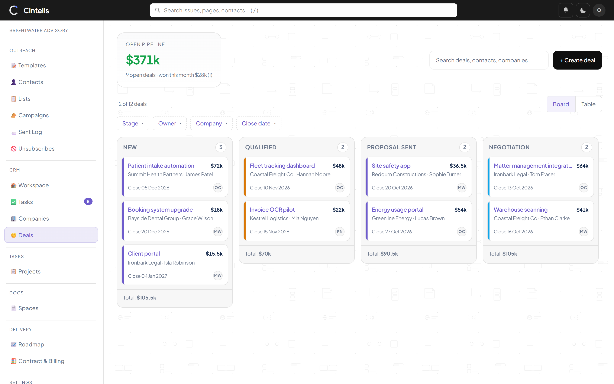
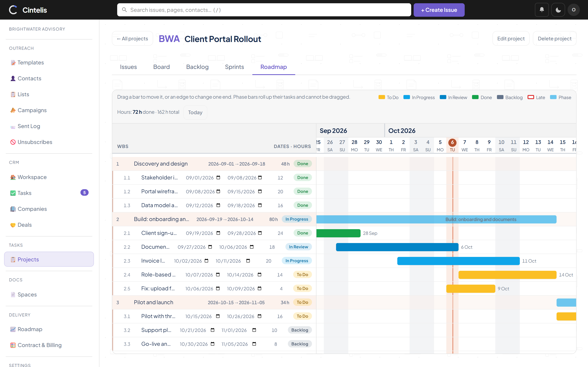
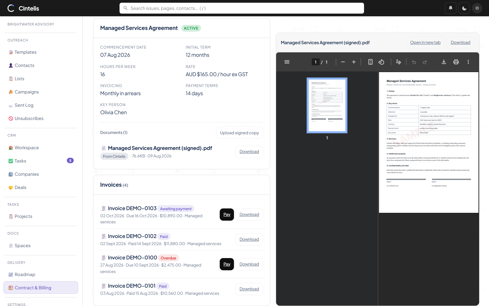
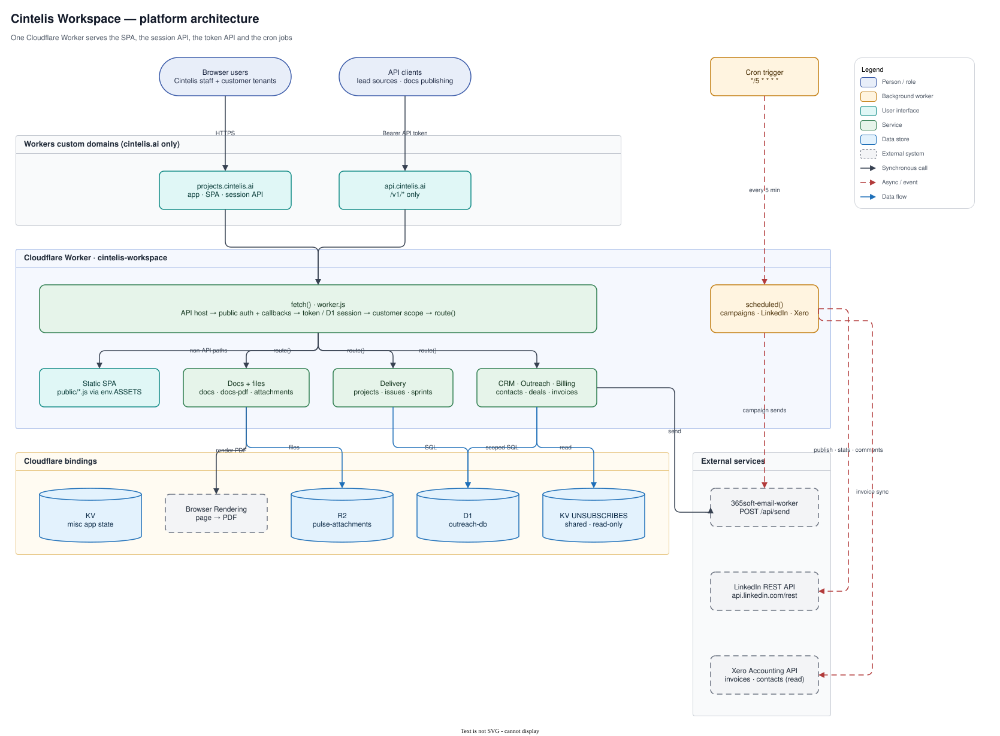
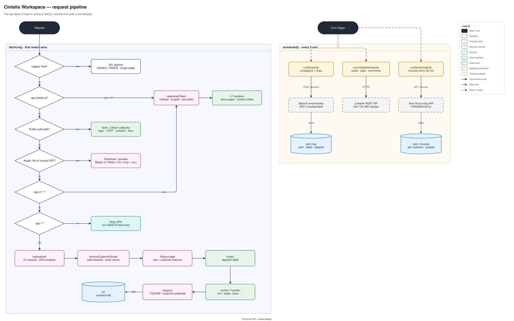

# Cintelis Workspace


**A multi-tenant business workspace — CRM, outreach, delivery, docs and billing — built and run by
[Cintelis](https://cintelis.ai) on a single Cloudflare Worker.**

Cintelis uses it every day to run its own sales and delivery, and onboards client companies as
isolated tenants who see their projects, roadmap, documents, contract and invoices in one place.

> **About this repository.** This is a public snapshot of a private production codebase, shared to
> show how it is built. It is not maintained here and does not accept contributions. All rights
> reserved. Interested in something similar for your business? Get in touch at
> [cintelis.ai](https://cintelis.ai).

## What it demonstrates

- **Real multi-tenancy, enforced in one place.** Customers are isolated tenants. Every query on a
  customer-owned table goes through a single scoping helper, and CI fails on any query that
  bypasses it.
- **Integrations done properly.** Xero (OAuth 2.0 with rotating refresh tokens, incremental invoice
  sync, PDFs and pay-online links for customers), LinkedIn (Ad Library and page publishing,
  analytics, comments) and a transactional email gateway.
- **A lot of product in very little platform.** One Worker, no framework, no build step: D1 for
  data, R2 for files, KV, Browser Rendering for server-side PDFs, and a cron for campaigns and syncs.
- **Security basics, done by default.** D1-backed sessions, optional TOTP 2FA with backup codes,
  hashed and scoped API tokens, role- and tenant-gated features on both server and client.
- **Documentation that stays current.** Architecture diagrams below are editable draw.io files
  generated from specs, so they are redrawn rather than left to rot.

<!--
## Screenshots

| | |
|---|---|
|  |  |
|  |  |
-->

---

## What's inside

| Area | Highlights |
|---|---|
| **Outreach** | HTML email templates, contacts (with CSV import), lists, multi-step campaigns (immediate / scheduled / recurring / drip), unsubscribe handling shared with the email worker |
| **CRM** | Contact lifecycle stages, companies, a Deals board (amount, close date, owner), CRM tasks and a sales workspace, contact record with timeline and one-off email |
| **Tasks / Issues** | Projects, issues with custom fields, dependencies, start & due dates, full-page issue view, Jira-style board, comments with @mention, issue cloning |
| **Sprints / Roadmap** | Sprint planning, active-sprint overview, kanban filtered by sprint, WBS + Gantt roadmap |
| **Docs / Wiki** | Spaces, slug-based page URLs, Confluence-style sidebar, wiki-link autocomplete `[[Space/Page]]`, Mermaid diagrams, server-side PDF export with page numbers, programmatic publishing via v1 API |
| **Attachments** | R2-backed file storage on issues and pages, in-app modal preview for docx/xlsx/csv/pdf/video/audio/JSON/text |
| **LinkedIn** | Ad Library search (ads + Brand Partnership posts) and Community Management: scheduled page posts, analytics snapshots, comment ingest and replies |
| **Customers** | Tenant onboarding, contracts and billing, per-customer feature flags, per-customer email sending identity |
| **Xero** | Read-only link to Cintelis's Xero: each customer is linked to a Xero contact, and their issued invoices (status, PDF, pay-online link) appear on Contract & Billing |
| **Notifications** | In-app + email, @mention notifications, click-through to the source issue or page |
| **Auth & users** | D1-backed sessions, TOTP 2FA with backup codes, user avatars, password change, admin-managed users |
| **Admin** | Feature visibility toggles, API tokens for the v1 API |

---

## Architecture

Both figures are editable `.drawio.svg` files: GitHub shows them as pictures, and draw.io (desktop,
web or the VS Code extension) opens the same file for editing. Save in draw.io and the picture is
redrawn in place.

### Platform



Both cintelis.ai hostnames land on the same Worker. `fetch()` handles the SPA, the session API and
the token API; `scheduled()` runs on the `*/5` cron for campaign sends, LinkedIn jobs and the Xero
invoice sync. Email goes out through `365soft-email-worker`, which also owns the unsubscribe store
this Worker only reads.

### Request pipeline



`fetch()` is a top-down `if` chain, so order matters: legacy-host redirect, the `api.cintelis.ai`
host, public auth endpoints and OAuth callbacks, avatar, attachment and invoice-PDF links (which
accept `?token=` because ``, `<iframe>` and `<a>` cannot send headers), the token-authenticated `/api/v1/*`, then every other `/api/*`
behind a D1 session. Customer users then pass `enforceCustomerScope` (a deny-by-default path
allowlist plus per-entity ownership) and the feature gate before `route()` dispatches to a
`worker/` module. Queries on customer-owned tables go through `worker/scope.js`, which adds the
customer predicate at each `/*SCOPE*/` marker.

### Stack

- **Runtime:** Cloudflare Worker, vanilla JS, no build step
- **Frontend:** vanilla JS + HTML in `public/` (router, SPA-style hash URLs)
- **Database:** D1 (`outreach-db`)
- **KV:** `KV` for misc app state, `UNSUBSCRIBES` shared (read-only) with `365soft-email-worker`
- **R2:** `pulse-attachments` for issue/page files
- **Browser Rendering:** `BROWSER` binding for server-side PDF export of doc pages
- **Cron:** every 5 minutes — campaign scheduler + LinkedIn scheduler
- **Auth:** D1-backed session (7-day TTL); optional TOTP 2FA per user

### Repo layout

```
worker.js                  Main entry — router, auth gate, cron handler
worker/                    Feature modules
  crm.js                   Outreach + CRM: templates, contacts, lists, campaigns, scheduler, pipeline, contact record
  crm-tasks.js             CRM tasks (to-do/call/email/meeting) + the sales Workspace
  crm-companies.js         Companies and contact↔company linking
  crm-deals.js             Deals (stage, amount, close date, owner) — the Deals board and record
  email.js                 Email gateway call + per-customer sending identity
  scope.js                 Customer scoping helper — the only way a customer-owned table is queried
  tasks.js                 Projects + issues + custom fields
  sprints.js               Sprint CRUD + board
  docs.js                  Doc spaces + pages + wiki-links
  docs-pdf.js              Server-side PDF rendering via Browser Rendering
  attachments.js           R2 upload / download / preview
  notifications.js         In-app + email notifications
  customers.js             Customer tenants, contracts, tenant isolation guard
  api-v1-docs.js           Public v1 API for programmatic docs publishing
  api-tokens.js            Admin token issuance
  app-settings.js          Feature visibility flags
  custom-fields.js         Per-project custom field definitions
  dependencies.js          Issue dependency graph
  entity-links.js          Cross-entity links
  events.js                Activity timeline events
  linkedin.js              LinkedIn Ad Library + Community Management
  config.js                Public origin, API host, legacy hosts
  api-v1-crm.js            Public v1 contact intake
  auth.js / sessions.js    Login, TOTP, password change
public/                    SPA, CSS, UI modules
migrations/                Numbered SQL migrations (001 → 022)
schema.sql                 Authoritative schema
wrangler.toml              Bindings + cron + custom domain config
```

---

## Setup

### 1. Install Wrangler & log in
```bash
npm install -g wrangler
wrangler login
```

### 2. Create / link bindings

```bash
# D1 database
wrangler d1 create outreach-db
# → paste database_id into wrangler.toml [[d1_databases]]

# Sessions KV
wrangler kv:namespace create KV
# → paste id into wrangler.toml [[kv_namespaces]] (binding="KV")

# Shared unsubscribe KV — re-use the email worker's namespace ID
wrangler kv:namespace list
# → paste UNSUBSCRIBES id into wrangler.toml [[kv_namespaces]] (binding="UNSUBSCRIBES")

# R2 bucket for attachments
wrangler r2 bucket create pulse-attachments
```

Browser Rendering is enabled via the `[browser]` block in `wrangler.toml` — no separate command.

### 3. Apply migrations

```bash
# Fresh install — apply schema
wrangler d1 execute outreach-db --file=schema.sql

# OR apply numbered migrations in order
for f in migrations/*.sql; do wrangler d1 execute outreach-db --file=$f; done
```

### 4. Set secrets

```bash
wrangler secret put ADMIN_USER
wrangler secret put ADMIN_PASS
wrangler secret put CF_ACCESS_CLIENT_ID       # optional — Cloudflare Access for email worker
wrangler secret put CF_ACCESS_CLIENT_SECRET   # optional — Cloudflare Access for email worker
wrangler secret put LINKEDIN_CLIENT_SECRET    # optional — LinkedIn Ad Library API
wrangler secret put XERO_CLIENT_ID            # optional — Xero invoice sync
wrangler secret put XERO_CLIENT_SECRET        # optional — Xero invoice sync
```

For **Xero**, create a Web app at developer.xero.com with redirect URI
`https://projects.cintelis.ai/api/xero/callback`. Apps created after 2 March 2026 use granular
scopes; the app requests `offline_access accounting.invoices.read accounting.contacts.read`
(override with `XERO_SCOPES`). An internal admin then connects from **Settings › Integrations**
and links each customer to its Xero contact on the customer's page. Invoices sync every 30 minutes
(`XERO_SYNC_MINUTES`); customers see awaiting-payment and paid invoices, never drafts.

For the **LinkedIn Ad Library** page, also register the OAuth redirect URL
`https://projects.cintelis.ai/api/linkedin/callback` in your LinkedIn app's Auth settings
(client ID `86y9c1txmueuv2`). An admin then connects once from the LinkedIn Ads page; the shared
token is stored server-side and reused for everyone. Overridable via `LINKEDIN_CLIENT_ID`,
`LINKEDIN_REDIRECT_URI`, `LINKEDIN_OAUTH_SCOPE`.

On the **email worker** side (one-time):
```bash
wrangler secret put MAIL_UNSUBSCRIBE_BASE_URL --name 365soft-email-worker
wrangler secret put MAIL_UNSUBSCRIBE_NOTIFY_EMAIL --name 365soft-email-worker
```

### 5. Deploy

```bash
wrangler deploy
```

---

## Feature reference

### Deals vs contact lifecycle

Since sprint 15 the **Deals** board tracks opportunities (`deals`: New → Qualified → Proposal sent →
Negotiation → Closed won / Closed lost, each with an amount, expected close date and owner, linked to a
contact and/or company). A contact keeps a **lifecycle** stage (below); winning a deal moves its contact to
Won. Money figures everywhere (board totals, workspace, company and contact records) come from deals;
`contacts.deal_value` is legacy.

### CRM pipeline stages

| Stage | Meaning |
|---|---|
| Lead | Initial contact, not yet qualified |
| Prospect | Engaged, showing interest |
| Qualified | Confirmed need and budget |
| Proposal | Proposal or quote sent |
| Won | Deal closed |
| Lost | Not proceeding |

Pipeline value on the Overview counts all active (non-Won, non-Lost) contacts.

### Activity log types

`note`, `call`, `meeting`, `email`. `last_contacted_at` updates automatically when a campaign send succeeds.

### Email merge tags

| Tag | Resolved by | Value |
|---|---|---|
| `{{name}}` | Outreach worker | Contact's name (fallback: "there") |
| `{{email}}` | Outreach worker | Contact's email |
| `{{company}}` | Outreach worker | Contact's company |
| `{{unsubscribe_url}}` | Email worker | HMAC-signed link (auto) |
| `{{physical_address}}` | Email worker | From `MAIL_PHYSICAL_ADDRESS` secret |

Always include an unsubscribe link — the email worker resolves the URL automatically:
```html
<p style="font-size:11px;color:#888;text-align:center;margin-top:32px">
  <a href="{{unsubscribe_url}}" style="color:#888">Unsubscribe</a>
</p>
```

### Campaign schedule types

| Type | Behaviour |
|---|---|
| Immediate | Draft mode — manual send |
| Once | Fires automatically at the configured time |
| Recurring | Repeats on a fixed-day interval |
| Drip | Per-contact enrolment, configurable inter-step delays |

The cron trigger runs every 5 minutes and processes all active scheduled campaigns. If a contact unsubscribes mid-drip, the email worker returns `403 RECIPIENT_UNSUBSCRIBED`; the outreach worker logs `skipped` and stops that contact's drip.

### CSV import format

```csv
email,name,company,stage,deal_value,phone
nick@example.com,Nick Smith,Acme Corp,prospect,5000,+61400000000
jane@example.com,Jane Doe,Beta Inc,lead,,
```

`email` required; everything else optional.

### Docs / Wiki

- Spaces hold pages; pages have slug-based URLs and a parent–child tree
- Wiki-link autocomplete: `[[Space/Page]]` (or `[[Page]]` within the same space)
- Mermaid code fences render as diagrams in both the in-app reader and exported PDFs
- Page export → server-side PDF via Browser Rendering, including page-numbered footer
- Move-page modal supports re-parenting across the tree
- @mentions in comments raise a notification with deep-link

### Server-side PDF

`GET /api/doc-pages/:id/pdf` — uses `@cloudflare/puppeteer` against the `BROWSER` binding to render the page, then injects page numbers via the print footer template. Mermaid is rendered before the PDF is captured so diagrams appear in the export.

---

## API

All `/api/*` endpoints (except `/api/auth/*`) require either `Authorization: Bearer {sessionToken}` from the SPA or, for the **public v1 API**, an admin-issued token managed in Settings.

### Auth
| Method | Path | Notes |
|---|---|---|
| POST | `/api/auth/login` | `{username, password}` → `{token}` or `{require_totp:true}` |
| POST | `/api/auth/totp/login` | `{token, code}` → `{token}` |
| POST | `/api/auth/totp/login-backup` | `{token, backup_code}` → `{token}` |
| POST | `/api/auth/totp/setup` | Begin TOTP enrolment |
| POST | `/api/auth/totp/verify` | Confirm TOTP enrolment |
| POST | `/api/auth/totp/disable` | Remove TOTP |
| POST | `/api/auth/backup-codes/regenerate` | New set of single-use codes |
| POST | `/api/auth/password/change` | `{current, new}` |
| GET | `/api/auth/check` | Session check |
| POST | `/api/auth/logout` | Invalidate current session |

### Me / users
| Method | Path |
|---|---|
| GET | `/api/me` |
| PATCH | `/api/me/preferences` |
| POST | `/api/me/avatar` |
| GET | `/api/me/saved-filters` / PUT same |
| GET | `/api/me/my-issues` |
| GET | `/api/me/notifications` |
| GET / POST | `/api/users` |
| GET | `/api/users/mention-search?q=` |

### Outreach
Templates, contacts, lists, campaigns, logs, unsubscribes — full CRUD as before.
`GET /api/contacts?q=&stage=`, `POST /api/contacts/import` (CSV), `POST /api/campaigns/:id/send`, etc.

**Per customer (sprint 9).** Every CRM and Outreach table carries a nullable `customer_id`
(`NULL` = Cintelis's own rows). A customer user only ever sees their own contacts, lists,
templates, campaigns and logs; staff see everything and can narrow any list with
`?customer_id=<id>` or `?customer_id=internal`. The `crm` and `outreach` customer features
gate the nav and the API separately. A customer's campaigns send under the sending identity set
by staff on the customer page (`GET/PUT/DELETE /api/customers/:id/sender` → an `email`
integration holding `from_email`, `from_name`, the Cloudflare Access service token and an
optional gateway URL); with none set, their sends fail rather than going out as Cintelis.

All reads and writes of customer-owned tables go through `worker/scope.js` and carry a
`/*SCOPE*/` marker where the customer predicate belongs; `npm run check:scoping` fails on any
statement that bypasses it.

### CRM
| Method | Path |
|---|---|
| GET | `/api/crm/pipeline` |
| GET | `/api/crm/stats` |
| GET | `/api/crm/followups` |
| GET / PATCH | `/api/crm/contact/:id` |
| GET / POST | `/api/crm/contact/:id/notes` |
| DELETE | `/api/crm/contact/:id/notes/:noteId` |
| GET | `/api/crm/contact/:id/record` — contact + timeline + tasks + associations for the record page |
| POST | `/api/crm/contact/:id/email` — one-off email through the tenant's sending identity, logged to sent_log |
| GET / POST | `/api/crm/tasks`, PATCH / DELETE `/api/crm/tasks/:id` (`?queue=today\|overdue\|upcoming\|open\|done`) |
| GET | `/api/crm/workspace` — task counters, guided actions, today's list, feed |
| GET / POST | `/api/crm/companies`, GET / PATCH / DELETE `/api/crm/companies/:id` |
| GET / POST | `/api/crm/deals` (`?contact_id=&company_id=&status=open\|closed`), GET `/api/crm/deals/stats`, GET / PATCH / DELETE `/api/crm/deals/:id`, POST `/api/crm/deals/:id/notes` |

### Tasks / sprints
| Method | Path |
|---|---|
| `/api/projects` | Project CRUD + per-project custom fields |
| `/api/issues` | Issue CRUD, dependencies, comments, clone |
| `/api/sprints` | Sprint CRUD + board |
| `/api/overview/active-sprints` `/due-soon` `/recent-activity` `/team-workload` | Dashboard widgets |

### Docs
| Method | Path |
|---|---|
| `/api/doc-spaces` | Space CRUD |
| `/api/doc-pages` | Page CRUD, move, comments |
| GET | `/api/doc-pages/:id/pdf` | Server-side PDF |

### Attachments / search / linking
| Method | Path |
|---|---|
| GET / POST / DELETE | `/api/attachments` |
| GET / POST / DELETE | `/api/entity-links` |
| GET | `/api/entity-search?q=` |
| GET | `/api/search?q=` |

### Xero
| Method | Path | Who |
|---|---|---|
| GET | `/api/xero/status` | internal admin |
| GET | `/api/xero/connect` → Xero → `/api/xero/callback` | internal admin |
| POST | `/api/xero/disconnect`, `/api/xero/sync` | internal admin |
| PUT | `/api/xero/tenant` `{tenant_id}` — switch organisation (clears links) | internal admin |
| GET | `/api/xero/contacts?q=` | internal admin |
| PUT / DELETE | `/api/customers/:id/xero-contact` `{contact_id, contact_name}` | internal admin |
| GET | `/api/customers/:id/invoices` — every status | internal admin |
| GET | `/api/customer/invoices` — own AUTHORISED + PAID | customer user (`billing` feature) |
| GET | `/api/xero/invoices/:id/(download\|preview)` — PDF from Xero; Bearer or `?token=` | owner or internal admin |

### Public v1 API (token-auth, programmatic publishing)

Served on its own host, **https://api.cintelis.ai**, which answers only `/v1/*`
(the same handlers are still reachable as `projects.cintelis.ai/api/v1/*` for
older integrations). `GET /` on the API host describes the endpoints.

```
POST   /v1/docs/pages              Create or upsert a page            (docs:write)
GET    /v1/docs/pages?space=&slug= Fetch a page by slug               (docs:read)
DELETE /v1/docs/pages?space=&slug= Delete a page                      (docs:write)
POST   /v1/contacts                Create or update a contact by email (crm:write)
```

`POST /api/v1/contacts` body: `{ email, name?, phone?, company?, stage?, deal_value?, tags?, note? }`.
A `deal_value` creates a deal for the contact (one open deal per contact from intake; a repeat enquiry
only adds the note). A `company` is linked to the tenant's company of that name, creating it if new.
Upserts by email: a new contact is created at the given `stage` (default `lead`); an existing one keeps
its stage, has blank fields filled in and tags merged, and `note` is appended to its activity. Used by
external lead sources such as a website quote form. The token decides the tenant: a token
minted by a customer admin writes into that customer's CRM (the customer must be active with the
`crm` feature on), an internal token into Cintelis's own.

Tokens are issued in **Settings → API tokens** (admin only).

---

## Security notes

- Login credentials and provider keys live as Cloudflare secrets — never in source or `wrangler.toml`
- Sessions are stored in D1 with a 7-day TTL; logout invalidates the token immediately
- Optional TOTP 2FA per user, with single-use backup codes
- Public v1 API tokens are scoped, hashed at rest, and revocable
- `/api/*` returns `401` for any unauthenticated request
- Unsubscribe page lives on the email worker and is HMAC-SHA256 signed
- No third-party analytics in the dashboard

---

## Maintenance

```bash
# Redeploy
wrangler deploy

# Live request logs
wrangler tail

# Database queries
wrangler d1 execute outreach-db --command="SELECT stage, COUNT(*) FROM contacts GROUP BY stage"

# Apply a new migration
wrangler d1 execute outreach-db --file=migrations/0NN_your_change.sql

# Inspect KV
wrangler kv:key list --namespace-id $KV_ID
wrangler kv:key list --namespace-id $UNSUBSCRIBES_KV_ID --prefix "unsub:"

# R2
wrangler r2 object list pulse-attachments
```

---

## Related workers

- **`365soft-email-worker`** — outbound email, HMAC unsubscribe, owns `UNSUBSCRIBES` KV. Cintelis Workspace only reads from that KV; all writes happen on the email worker.
